# 前言：关于版权与教程

西北农林科技大学的耿楠老师的视频教程，学习前先学习电脑基本教程，不要抱怨。

版权归Hans J. Han 所有，禁止转载！

内容有误提交 PR ，谢谢！

## 第一节：下载texlive.iso
[Index of /CTAN/systems/texlive/Images/ | 清华大学开源软件镜像站 | Tsinghua Open Source Mirror](https://mirrors.tuna.tsinghua.edu.cn/CTAN/systems/texlive/Images/)

[Index of /github-release/texstudio-org/texstudio/ | 清华大学开源软件镜像站 | Tsinghua Open Source Mirror](https://mirrors.tuna.tsinghua.edu.cn/github-release/texstudio-org/texstudio/)

### 1、常用命令：

- 检查texlive是否安装成功：
```
tex -v
```
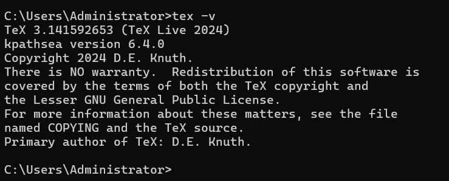

- 检查latex是否安装成功：
```
latex -v
```
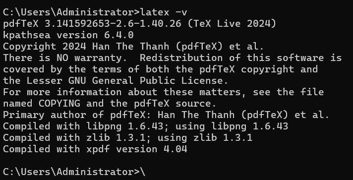

- 检查xelatex是否安装成功：
```
xelatex -v
```

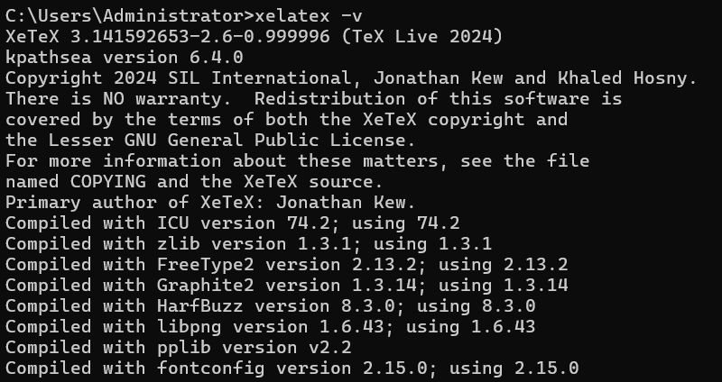
若版本信息正常输出，则正常安装。

- 获取上面宏包最新版本更新：
```
tlmgr update --all
```

- 查看所有更新的宏包指令：

```text
tlmgr update --list
```

- 更新所有需要更新的宏包：

```text
tlmgr update --self --all
```

- 如果遇到更新宏包过程中，某一个宏包更新失败，可以使用指令继续更新：

```text
tlmgr update --reinstall-forcibly-removed --all
```

- 疑惑：官方推荐重新安装：
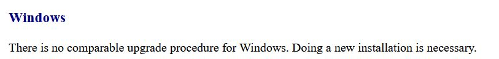

而不是使用升级指令？

### 2、使用简单记事本编辑

- 命令行创建

```
cd\

mkdir testLatex

cd testLatex

notepad test.tex
```

```
\documentclass {article}

\begin {document}

Hello \LaTeX.

\end {document}
```

- cmd输入：
```
latex test.tex
```

示例结果：
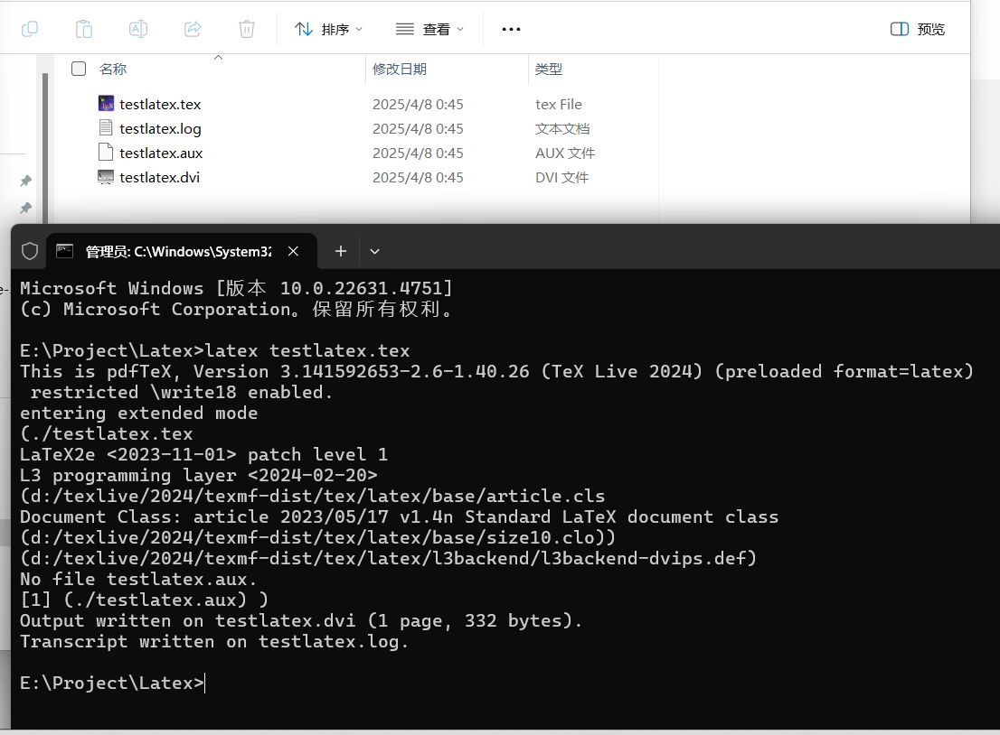

- 将dvi文件转为pdf：
```
dvipdfmx test.dvi
```

最终文件有：
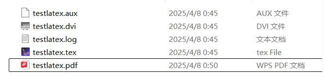

- 查看pdf
```
test.pdf
```

- 直接通过xelatex编译成pdf：（支持UTF-8，即支持中文）
```
xelatex testlatex.tex
```

命令行结果：
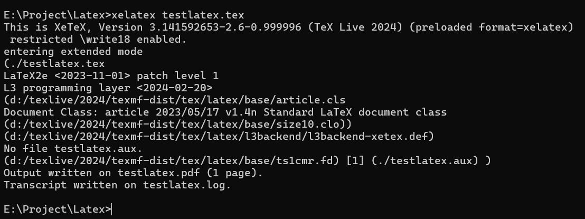

文件结果：
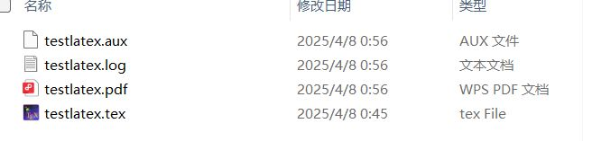

总结：少了dvi中间文件，直接输出pdf

### 3、使用TeXstudio编辑

很显然，使用 记事本很麻烦，我们使用跨平台集成的TeXstudio
[LaTex2024.zip](https://pan.baidu.com/s/13QE2qB_VaKJT2kF3w05IvQ?pwd=ugen)


XeLateX可以处理中文
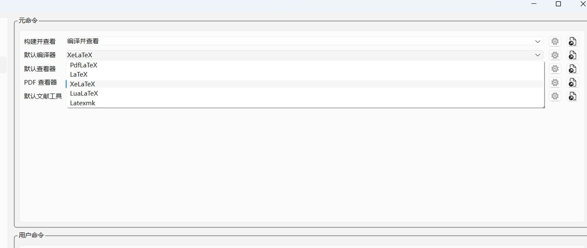


在界面上直接新建：
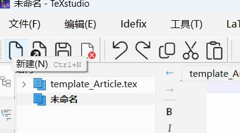

我们保存项目在一个文件夹里面，英文取名（在保存时会生成一些中间文件）
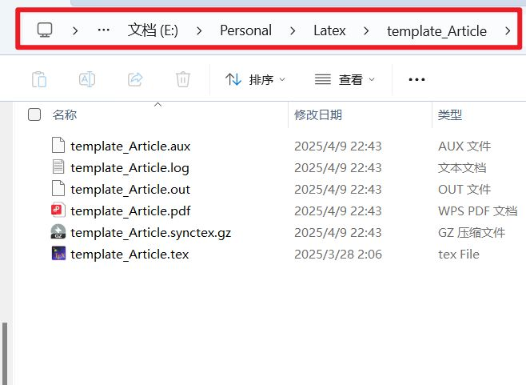


会有提示：
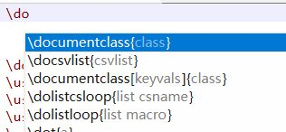

使用宏包ctex进行中文编码（注意文件使用UTF-8）

```
% 导言区
\documentclass{article}%book, report, letter
% 在letter中没有命令 \maketitle
\usepackage{ctex}

\title{Latex学习教程}
\author{Hans J. Han}
\date{\today}


% 注释行
% 正文区（文稿区）
\begin{document}
	\maketitle % 输出标题信息
	文本
	
	数学公式：$$\overline{M}_v=\left( \frac{\sum{m_iM_{i}^{\alpha}}}{\sum{m_i}} \right) ^{1/\alpha}=\left( \frac{\sum{n_iM_{i}^{\alpha +1}}}{\sum{n_iM_i}} \right) ^{1/\alpha}$$
\end{document}
```


