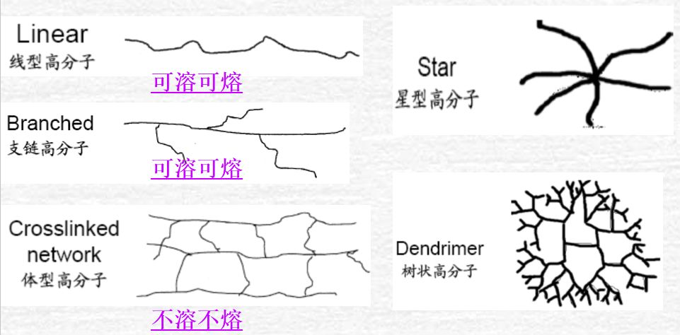
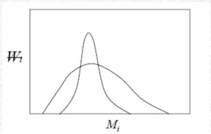
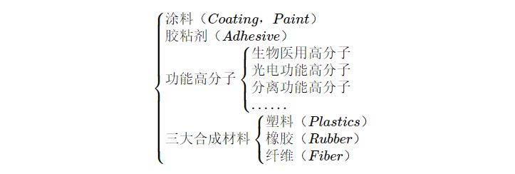
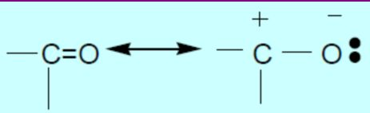
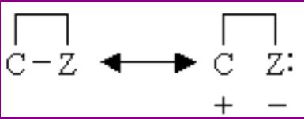
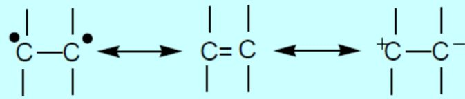

## 前言
感谢陈熙（教授）的课程，非常喜欢！
课件：[高分子化学](https://pan.baidu.com/s/1crktta890pKungyxwKQ9TA?pwd=5frj)
版权归于授课老师，感谢陈熙教授的教课，学到很多，请勿侵权，侵权必究！

高分子化学 -> Polymer Chemistry （聚合物化学）
聚合反应 -> Polymerization
聚合物的反应 -> Polymer Reaction

学习内容：反应机理、反应的影响因素、反应动力学、反应的实施方法

## 第一章 绪论

### 1.1高分子的基本概念 

#### 1.1.1 高分子的定义

**高分子：** 一个大分子往往由许多简单的结构单元通过共价键重复键接而成，分子量在10$^4$-10$^7$范围。（结构单元、共价键连结）

**区分**：单体、单体单元、重复结构单元（重复单元/链节）、结构单元

**聚合度(Degree of polymerization)：** 
聚合物分子量大小的一个指标，在聚合物的分子结构式中以n表示，也称为链节数。有两种表示方法：
1. 以大分子链中的结构单元数目表示，记作$\overline{X_n}$
2. 以大分子链中的重复单元数目表示，记作$\overline{DP}$

**如何通过聚合度计算聚合物分子量？**
$$M\,\,=\,\,DP\,\,\times \,\,M_0$$
$$M\,\,=\,\,X_n\,\,\times \,\,M_1$$
$M_0$：重复单元数的分子量　 $M_1$：结构单元数的分子量　

### 1.2 高分子化合物的基本特点

#### 特点一：分子量大（一般在一万以上）

聚合物作为材料许多优良性能都与分子量有关，如：
抗张强度(tensile strength）冲击强度(impact strength）
断裂伸长(breaking elongation） 可逆弹性(reversible elasticity）

常用的聚合物的分子量（万）:

| 塑料名称 | 分子量 | 纤维名称 | 分子量 | 橡胶名称 | 分子量 |
|----------|--------|----------|--------|----------|--------|
| 聚乙烯   | 6~30   | 涤纶     | 1.8~2.3| 天然橡胶 | 20~40  |
| 聚氯乙烯 | 5~15   | 尼龙-66  | 1.2~1.8| 丁苯橡胶 | 15~20  |
| 聚苯乙烯 | 10~30  | 维尼纶   | 6~7.5  | 顺丁烯胶 | 25~30  |

**平均分子量的表示方法**

1) 数均分子量（Number-averagemolecular weight）

某体系总质量m被分子总数n所平均
$$\overline{M}_n=\frac{m}{\sum{n_i}}=\frac{\sum{n_iM_i}}{\sum{n_i}}=\frac{\sum{m_i}}{\sum{\left( m_i/M_i \right)}}=\sum{x_iM_i}$$
数均分子量可通过**依数性方法**（冰点降低法、沸点升高法、渗透压法、蒸汽压法）和**端基滴定法**测定。

2) 重均分子量（Weight-average molecular weight）

一种按聚合物重量统计平均的分子量，即 i-聚体的分子量乘以其重量分数的加和：
$$\overline{M}_w=\frac{\sum{m_iM_i}}{\sum{m_i}}=\frac{\sum{n_iM_{i}^{2}}}{\sum{n_iM_i}}=\sum{w_iM_i}$$
上式中，$m_i$  $M_i$ 分别代表i-聚体的质量和分子量。可通过**光散射法**测定。

3) 粘均分子量（Viscosity-average molecular weight)

对于一定的聚合物-溶剂体系，其特性粘数$[\eta ]$和分子量的关系（Mark-Houwink方程）如下：
$$\overline{M}_v=\left( \frac{\sum{m_iM_{i}^{\alpha}}}{\sum{m_i}} \right) ^{1/\alpha}=\left( \frac{\sum{n_iM_{i}^{\alpha +1}}}{\sum{n_iM_i}} \right) ^{1/\alpha}$$

K，α是与聚合物、溶剂有关的常数，称Mark-Houwink方程参数
$$[\eta ]=K\overline{M}^{\,\,\alpha}$$
一般，α值在0.5～0.9之间，故$\overline{M}_v$ < $\overline{M_w}$

$\overline{M_w}>\overline{M_v}>\overline{M_n}$ , $\overline{M_v}$ 略低于$\overline{M_w}$

- $\overline{M_n}$靠近聚合物中低分子量的部分，即低分子量部分对其影响较大
- $\overline{M_w}$靠近聚合物中高分子量的部分，即高分子量部分对其影响较大

一般用$\overline{M_w}$来表征聚合物比$\overline{M_n}$更恰当，因为聚合物的性能如强度、熔体粘度更多地依赖于样品中较大的分子。

---

#### 特点二：组成简单、结构有规

组成高分子的原子数目虽然成千上万，但所涉及的元素种类却十分有限，以**C、H、O、N**四种非金属元素最为普遍，**S、CI、F、Si**也存在于一些高分子中。

高分子的主链多由重复结构单元以共价键形式相连接。
**共价键：** 非金属原子间通过共用电子对（电子云的重叠）所形成的化学键。

---

#### 特点三：分子形态呈多样性。
绝大多数聚合物呈长链线型，因此有“分子链”之称

#### 特点四：分子量具多分散性（Polydispersity）
即存在着分子量分布（MolecularWeightDistribution，MWD）

聚合反应中，因官能团之间成键的不确定性，或者聚合物活性链的年龄与寿命不同，聚合产物的往往是化学元素相同但分子量不同的同系聚合物的混合物。

**因此应注意：**
- 一般测得的高分子的分子量都是**平均分子量**
- 聚合物的平均分子量相同，但分散性不一定相同

分子量多分散性表示方法：
单独一种平均分子量不足以表征聚合物的性能，还需要了解分子量的多分散性程度。

1) 以分子量分布指数（$DI$）表示
即重均分子量与数均分子量的比值，$DI$ = $\overline{M_w}/\overline{M_n}$
- 单分散性聚合物：$DI$ = 1，$\overline{M_w}=\overline{M_n}$
- 常见聚合物：$DI$ = 2～50
- 缩聚物的$DI$一般小于加聚物的$DI$

2) 以分子量分布曲线表示
将聚合物样品分成不同分子量的级分，测定其重量分率。以各级分的重量分率对其平均分子量作图，得到**重量基分子量分布曲线**。

常用凝胶渗透色谱仪（Gel PermeationChromatography, GPC）测定。
该方法的优点：
- 直观地判断分子量分布的宽窄
- 由谱图计算各种平均分子量

**分子量分布是影响聚合物性能的因素之一**
- 分子量过高部分使聚合物的强度增加，但加工成型时塑化困难
- 低分子量部分使聚合物强度降低，但易于加工
**不同用途的聚合物应有其合适的分子量分布**
- 合成纤维：分子量分布宜窄
- 塑料、橡胶：分子量分布可宽

#### 特点五：具有显著的多层次结构
**A. 微观结构**（结构单元的元素组成与排列，重复单元的连接方式与空间排列等）

聚氯乙烯分子中的头-头结构多达16%
全同立构（Isotactic）
间同立构（Syndiotactic）
无规立构（Atactic）
顺式聚丁二烯是性能很好的天然橡胶
反式聚丁二烯则是塑料

**B.聚集态结构（Stateofaggregation）**
分子通过次价键力聚集在一起，形成了特定聚集态结构：固态、液态和气态。
高分子分子量大，分子间的作用力也大，因此只有固体和液态两种。
固态聚合物：
- 结晶态（crystalline）
- 无定型态（amorphous）
$T_g$和$T_f$,非晶态高分子的两个重要的特征温度。
液态聚合物：
- 粘流态（viscous state）
$T_m$和$T_g$**分别是结晶态和无定型高分子的主要热转变温度**

### 1.3 高分子化合物的分类和命名

#### A.分类
1) 根据产品的性能和用途分

2) 根据高分子的主链结构分类
- 碳链聚合物
大分子主链完全由碳原子组成，绝大部分烯类、双烯类聚合物属于这一类，如：PE，PP，PS，PVC等。
- 杂链聚合物
大分子主链中除碳原子外，还有O、N、S等杂原子，如聚酯、聚酰胺、聚氨酯、聚醚等。
- 元素有机聚合物
大分子主链中没有碳原子，主要由Si、B、Al、 O、N、S、P等原子组成，侧基则由有机基团组成，如：硅橡胶等。
- 无机高分子
主链和侧链均无碳原子，如：硅酸盐等。

#### B.命名
##### 1.第一类
1) 以单体名称为基础命名
- 均聚物：“聚（Poly）”＋单体名

乙烯 →聚乙烯(Polyethylene,PE)
甲基丙烯酸甲酯→聚甲基丙烯酸甲酯(Polymethyl methacrylate, PMMA)

也有以假想单体为基础命名，如聚乙烯醇（polyvinyl alcohol）
乙烯醇为假想的单体，聚乙烯醇实际上是**聚醋酸乙烯**(polyvinyl acetate)的水解产物。

- 共聚物：
共聚物：取单体简名，在后面加树脂(Resin)或橡胶(Rubber)
合成树脂：
尿素+甲醛 → 脲醛树脂
甘油+邻苯二甲酸酐→ 醇酸树脂
苯酚(Phenol)+甲醛(formaldehyde)→ 酚醛树脂(PF Resin)

合成橡胶：
丁二烯(Butadiene)+苯乙烯(Styrene)→ 丁苯橡胶(SBR)
丁二烯(Butadiene)+丙烯腈(Acrylonitrile）→ 丁腈橡胶
乙烯(ethylene)+丙烯(propylene）→ 乙丙橡胶(EPR）

2) 以高分子链的结构特征命名
聚酰胺
聚氨酯
聚醚
聚酯

3) 商品名（合成纤维最普遍，我国以“纶”作为合成纤维的后缀），如
涤纶: 聚对苯二甲酸乙二醇酯（聚酯）
锦纶: 聚酰胺，常称尼龙（Nylon），在其后加数字区别
丙纶: 聚丙烯

- 尼龙-66一一己二胺(hexanediamine)和己二酸(adipicacid)合成的产物，学名聚己二酰己二胺。
- 尼龙-610—一己二胺(hexanediamine)和癸二酸(sebacicacid)合成的产物，学名聚癸二酰己二胺
- 尼龙-6一一是己内酰胺(caprolactam)或w-氨基已酸的产物，学名：聚己内酰胺。

第一个数字表示二元胺的碳原子数，第二个数字表示二元酸的碳原子数，只附一个数字表示内酰胺或氨基酸的碳原子数。

4) 英文缩写
ABS：丙烯睛(**A**crylonitrile)-丁二烯(**B**utadiene) 苯乙烯(**S**tyrene)共聚物
SBR：丁苯橡胶(**S**tyrene-**B**utadiene **R**ubber)
EVA：乙烯(**E**thylene)-醋酸乙烯(**V**inyl **A**cetate)的共聚物

| 名称 | 俗名 | 英文 | 名称 | 俗名 | 英文 |
|------|------|------|------|------|------|
| 聚乙烯 | PE | polyethylene | 聚碳酸酯 | PC | polycarbonate |
| 聚丙烯 | PP | polypropylene | 聚丙烯酰胺 | PAM | polyacrylamide |
| 聚异丁烯 | PIB | polyisobutylene | 聚丙烯酸甲酯 | PMA | polymethyl acrylate |
| 聚苯乙烯 | PS | polystyrene | 聚甲基丙烯酯 | PMMA | polymethylmethacrylate |
| 聚氯乙烯 | PVC | Polyvinyl chloride | 聚醋酸乙烯 | PVAc | polyvinyl acetate |
| 聚四氟乙烯 | PTFE | Polytetrafluoroethylene | 聚乙烯醇 | PVA | polyvinyl alcohol |
| 聚丙烯酸 | PAA | polyacrylic acid | 聚丁二烯 | PB | polybutadiene |
| 聚酯 | PET | polyester | 聚丙烯腈 | PAN | polyacrylnitrile |

##### 2.结构系统命名法
由（International UnionofPure and Applieo Chemistry，IUPAC）提出
命名程序：
- 确定重复单元结构
- 排出重复单元中次级单元（subunit）的次序，两个原则： 
1. 对乙烯基聚合物，先写有取代基的部分
2. 连接元素最少的次级单元写在前面
- 给重复单元命名，在前面加“聚”字

略

---

### 1.4 聚合反应的分类

单体 ->通过聚合反应-> 聚合物

- 按单体、聚合物的组成和结构变化分类
- 按聚合机理或动力学分类

1. 按单体和聚合物的组成和结构变化分类
1) 加聚反应（additionpolymerization)：烯类单体加成而聚合起来的反应
加聚反应的生成物称加聚物（additionpolymer）
**特点：**
- 聚合物的结构单元与单体组成相同，分子量是单体分子量的整数倍
- 聚合过程无副产物生成
2) 缩聚反应（polycondensation)：单体经多次缩合而聚合成大分子的反应
缩聚反应的主产物为缩聚物（condensationpolymer）
**特点：**
- 官能团之间反应，缩聚物有特征结构官能团
- 有低分子副产物
- 缩聚物和单体分子量不成整数倍
3) 开环聚合：环状单体键断裂而后聚合成线形聚合物的反应
$nNH(CH_2)_5CO$（己内酰胺）  $\xrightarrow{开环}$ $\ce{[NH(CH_2)_5CO]_n}$（尼龙-6）
该分类方法的难点：一些聚合反应其元素组成变化似加聚，而产物结构却似缩聚物

2. 按聚合机理 (mechanism)或动力学(kinetics)分类
- 连锁聚合(chainpolymerization)
活性中心(activecenter)引发单体，迅速**连锁增长**

- 逐步聚合(stepwise polymerization)
无活性中心，单体官能团间相互反应而逐步增长
**大部分缩聚属逐步机理，大多数烯类加聚属连锁机理**

| **链式聚合** | **逐步聚合** |
|--------------|--------------|
| **需活性中心**：自由基、阳离子或阴离子 | **无特定活性中心**，依赖官能团单体间的反应 |
| 单体引发后迅速连锁增长，包含链引发、增长、终止等基元反应，各步骤速率与活化能差异显著 | 反应逐步进行，每一步的速率与活化能相近 |
| 体系中仅存在单体和聚合物，无分子量递增的中间产物 | 体系中存在单体及一系列分子量递增的中间产物 |
| **转化率**随反应时间显著增加，**分子量**变化较小 | **分子量**随反应缓慢增长，**转化率**在短期内即达到较高水平 |

## 第三章 自由基聚合

这一章基本没有计算，全部是概念，记忆即可。吐槽一句：教授速度有点慢，我本人喜欢迅疾，嘻嘻，听困了。

### 3.1 概述
连锁聚合（Chain Polymerization）：**活性中心引发单体，迅速连锁增长的聚合**。烯类单体的加聚反应大部分属于连锁聚合。

活性中心（活性种）：能打开烯类单体的π键，使链引发和增长的物质。

1. 活性种的形成
	- 均裂(homolysis）R· | ·R →2$R^·$
	均裂结果：共价键上一对电子分属两个基团，带独电子的基团呈中性，称为自由基，
	- 异裂(heterolysis)  A:B→$A^＋$+$B^-$
	异裂结果：共价键上一对电子全部归属于某一基团，形成阴离子：另一缺电子的基团则成为阳离子
	
	自由基(Free radical)、阳离子(Cation）、阴离子(Anion)
	分别对应
	自由基聚合、阳离子聚合、阴离子聚合
2. 连锁聚合的单体及聚合反应类型
	- 羰基(carbonyl)化合物：
	
	如醛aldehyde、酮ketone、酸acid、酯ester
	
	C=0双键具有极性，羰基的π键异裂后具有类似离子的特性，可由阴离子或阳离子引发剂来引发聚合，不能进行自由基聚合。
	
	- 杂环(heterocyclics)：
	
	如环醚、环酰胺、环酯等
	
	
	C-Z单键不对称，异裂后具有类似于离子的特性，可由阴离子或阳离子引发剂来引发聚合，不能进行自由基聚合。
	
	- 乙烯基单体(vinyls)：如**苯乙烯**，**氯乙烯**等
	
	C=C双键既可以均裂也可异裂，因此可以进行自由基聚合或离子聚合。

### 3.2 烯类单体的聚合反应类型
取代基Y的*电子效应*决定了：
- 单体接受活性种的进攻的方式
- 单体的聚合机理
**电子效应：**
- 诱导效应（inductioneffect）：取代基的供、吸电子性
- 共轭效应（resonance effect）：由于轨道相互交盖而引起共轭体系中各键上的电子云密度发生平均化的一种电子效应

1) 无取代基：

	乙烯(ethylene)  CH2=CH2

	结构对称，无诱导效应和共轭效应，须在高温高压等条件下才能进行自由基聚合。

	$$C_2H_2\xrightarrow{1500\sim 2000atm,180\sim 200^{\circ}C}\left[ C_2H_2 \right] _n$$

2) 供电取代基(electron-donating substituent):如

	

	

	

	

	供电基团使-C=C-电子云密度增加，有利于阳离子的进攻;

	供电基团使碳阳离子增长种（cationic propagating species)电子云分散而共振稳定。

	

	带供电取代基的单体有利于阳离子聚合.

	取代基为烷基

	供电性较弱，丙烯(propylene)、丁烯(butylene)通过阳离子聚合只能得到低分子油状物。

	

	异丁烯(isobutylene)：一个碳原子上双甲基取代供电性相对较强，是α烯烃中唯一能阳离子聚合的单体。

3) 吸电取代基(electron-withdrawing substituent) 
	- 使双键电子云密度降低;
	- 使阴离子增长种(anionic propagating species)共轭稳定

	带吸电取代基的单体有利于阴离子聚合

- 许多带吸电子基团的烯类单体，如丙烯睛(acrylonitrile）丙烯酸酯类(acrylate)能同时进行阴离子聚合和自由基聚合

- 若基团吸电子倾向过强，如硝基乙烯(nitroethylene) 偏二睛乙烯等，只能阴离子聚合而难以进行自由基聚合

4) 诱导效应+共轭效应

	Y-诱导效应（弱）+共轭效应（弱）

	CH2=CH-Y

	氯乙烯中氯原子的诱导效应是吸电子性，但P元共轭效应却有供电性，两者均较弱，所以VC(vinyl chloride 只能自由基聚合

**Y-诱导效应（弱）+共轭效应（强）**

共轭效应占主导，所以只能进行阳离子聚合。

烷基乙烯基醚（Alkylvinylether）
- 诱导效应：烷氧基(alkoxy)具有吸电子性，使双键电子云密度降低。
- 共轭效应：氧上未共用电子对和双键形成P-π共轭，使双键电子云密度增加。

**Y-诱导效应（强）+共轭效应（强）**

CH2=CH-Y
- 带共轭体系的烯类单体如苯乙烯(styrene）、甲基苯乙烯(methyl styrene)、丁二烯(butadiene)及异戊二烯(isoprene)，π-π共轭，易诱导极化(polarization)，，能按三种机理进行聚合

**空间位阻效应**

由取代基的体积、数量及位置等引起的，在动力学上对聚合能力有显著影响，但不涉及对活性种的选择

1,1 双取代烯类单体（CH2=CXY）

结构不对称，极化程度增加，比单取代更易聚合，如偏二氯乙烯、偏二氟乙烯。若两个取代基均体积较大（如1,1 2苯基乙烯），只能形成二聚体(dimer）

1,2 双取代单体XCH=CHY一般不能均聚，如马来酸酐

三、四取代　XCH=CHY

一般不能聚合，但氟代乙烯例外

### 3.3.（聚合热力学）(Polymerization Thermodynamics) 

■热力学讨论范围：反应的可能性、反应进行的方向以及平衡方面的问题。

α-甲基苯乙烯在0℃常压下能聚合，但在61℃以上不加压就无法聚合，这属于热力学范畴。

■聚合热力学的主要目的：从单体结构来判断聚合可能性这对探索新聚合物的合成很重要。

1. 聚合热

△G = △H-T△S

△G>0聚合自发地进行

△G=0 聚合、解聚处于平衡

△G<0 解聚

因单体转变为聚合物时，体系的无序性减小，故△S<0且各种单体的聚合摘一般变化不大，约-105~125 J·m0l-1.K-1。因此，要使聚合反应进行，必须

1)△H<0

2)△H>TS

所以：
- 聚合反应必为放热反应（吸热为正，放热为负）
- 聚合热越大，聚合倾向也越大  －△H 聚合热 

